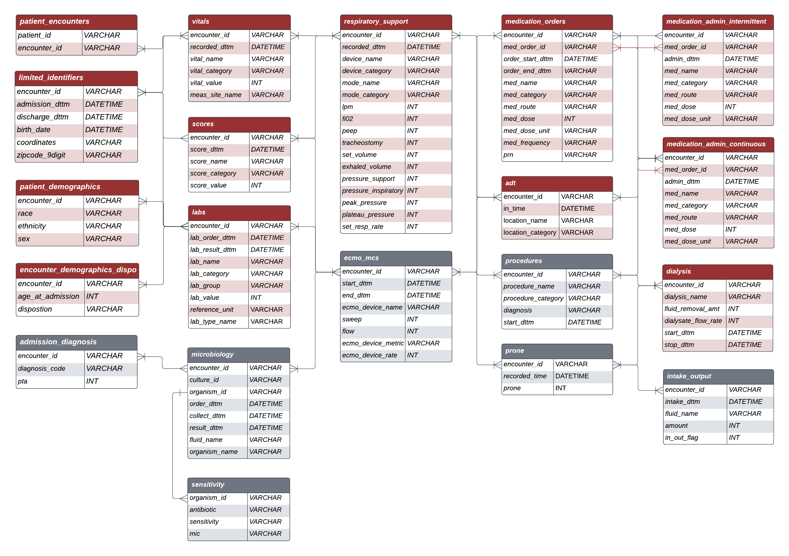

## Sample R-CLIF Tables

Relational CLIF has 19 tables that are organized into clinically relevant column categories - demographics, objective measures, respiratory support, orders and inputs-outputs. Below are sample templates for each table in R-CLIF

|  | 
|:--:| 
||

### Patient_encounters

| patient_id | encounter_id  | 
|-----------|----------|
| 1         | 1        | 
| 1         | 2        | 
| 1         | 3        | 
| 5         | 10       | 
| 6         | 11       | 
| 6         | 12       | 

* **patient_id** is an ID variable for each patient 
* **encounter_id** is an ID variable for each patient encounter (a given patient can have multiple encounters)

### Patient_demographics

| patient_id | race  | ethinicity | sex | 
|-----------|----------|------------|-----------|
| 1         | Black or African-American | Non-hispanic | Female |
| 5         | Black or African-American | Non-hispanic | Male | 
| 6         | White | Non-hispanic | Male |
| 32        | Black or African-American | Non-hispanic | Male |
| 43        | White | Hispanic | Female |
| 62        | Asian | Non-hispanic | Female |

* **patient_id** is an ID variable for each patient 
* **race** description of patient's race. Categories include Black or African-American, White, American Indian or Alaska Native, Asian, Native Hawaiian or Other Pacific Islander, Unknown, Other
* **ethnicity** description of patient's ethnicity. Categories include Hispanic or Non-Hispanic
* **sex** is the patient's biological sex - Male or Female

### Limited_identifiers

| encounter_id | admission_dttm  | discharge_dttm | birth_dttm | coordinates | zipcode_9digit |
|-----------|----------|------------|-----------|-------|-------|
| 1         | 8/27/2020  8:15:00 |8/27/2020  18:59:00  | 8/10/2014   | | |
| 2         | 6/28/2021  7:00:00 | 6/27/2021  19:00:00 | 2/11/2000   | | |
| 3         | 9/17/2021  8:43:00 | 9/17/2021  18:59:00 | 2/11/2000   | | |
| 10       | 8/12/2020  00:44:00 | 8/12/2020  18:59:00 | 4/21/1990   | | |
| 11         | 4/19/2021  6:23:00| 4/19/2021  18:59:00 | 1/23/2019   | | |
| 12         | 10/6/2022  10:43:00| 10/6/2022 18:59:00 | 1/23/2019   | | |

* **encounter_id** is an ID variable for each patient encounter (a given patient can have multiple encounters)
* **admission_dttm** is the date and time the patient is admitted (in the format %Y-%m-%d %H:%M:% )
* **discharge_dttm** is the date and time the patient is discharged (in the format %Y-%m-%d %H:%M:% )
* **birth_dttm** is the date of birth
* **coordinates** provide patient coordinates 
* **zipcode_9digit** 9 digit patient zip codes

### Encounter_demographics_disposition

| encounter_id | age_at_admission  |  disposition | 
|-----------|----------|-----------|
| 1         | 6 | Home |
| 2         | 22 | Home |
| 3         | 2 || Home |
| 10        | 20| Discharged to another facility |
| 11        | 2| Home
| 62        | 66| Hospice |

* **encounter_id** is an ID variable for each patient encounter (a given patient can have multiple encounters)
* **age_at_admission** is the age of the patient at the time of admission (in the format %Y-%m-%d %H:%M:% )
* **disposition** is the description of disposition when discharged. Categories include Home, Hospice, Discharged to another facility, Dead, Admitted and Other

### Vitals

| encounter_id | recorded_time  | vital_name |vital_category | vital_value | meas_site_name |
|-----------|----------|------------|-----------|-------|-------|
| 1         | 2022-05-05 04:18:00   | |respiratory_rate| 18        | not specified |
| 1         | 2022-05-05 04:18:00   | |spO2            | 97        | not specified |
| 1         | 2022-05-05 04:18:00   | |height          | 73        | not specified |
| 1         | 2022-05-05 04:18:00   | |temp            | 98.1      | not specified |
| 1         | 2022-05-05 04:18:00   | |heart_rate      | 73        | not specified |
| 1         | 2022-05-05 04:18:00   | |weight          | 1756.8    | not specified |

* **encounter_id** is an ID variable for each patient encounter ( a given patient can have multiple encounters )
* **recorded_time** is the date and time when the vital is recorded
* **vital_name** is the raw EHR string corresponding to the CLIF limited vocabulary for vital_category
* **vital_category** includes a limited number of vitals, namely - temp(C), pulse, sbp, dbp, sp02, respiration, map, height_in, weight_kg
* **vital_value** is the recorded value of the vital identified by the CLIF consortium 
* **meas_site_name** is the site where vital is recorded. It has three categories - arterial, core, not specified.

### Labs

| encounter_id | lab_order_time | lab_result_time | lab_group | lab_category |lab_name |lab_value  | reference_unit    | lab_type_name |
|-----------|----------|------------|-----------|-------|-------|--------------|----------|----------|
| 2         | 2022-09-30 17:50:00 | 2022-09-30 18:53:00 | CBC  | basophil  | |1 | % | standard;poc  | 
| 2         | 2022-09-30 17:50:00 | 2022-09-30 18:53:00 | CBC  | monocyte  | |7 | % | standard;poc  | 
| 2         | 2022-09-30 17:50:00 | 2022-09-30 18:53:00 | CBC  | neutrophil| |47 | % | standard;poc  | 
| 2         | 2022-09-30 17:50:00 | 2022-09-30 18:53:00 | CBC  | lymphocyte| |44 | % | standard;poc  | 
| 2         | 2022-09-30 17:50:00 | 2022-09-30 18:53:00 | CBC  | eosinophils| |1 | % | standard;poc  | 
| 2         | 2022-09-30 17:50:00 | 2022-09-30 18:53:00 | LFT  | bilirubin_unconjugated|  |0.9 | mg/dL | standard;poc  | 

* **lab_order_time** is the date and time when the lab is ordered
* **lab_order_time** is the date and time when the lab results are available 
* **lab_group** includes a limited number of labs that are categorized into five groups - ABG, BMP, CBC, Coags, LFT, Lactic Acid, Misc, VBG
* **lab_category** includes a limited number of labs identified by the CLIF consortium 
* **lab_name** is the raw EHR string corresponding to the CLIF limited vocabulary for lab_category 
* **lab_value** is the recorded value corresponding to a lab_name
* **reference_unit** is the unit of measurement for that lab
* **lab_type_name** has three categories - arterial, venous and standard/proc

### Respiratory_support

| encounter_id | recorded_time | device_name |device_category| mode_name | mode_category |lpm  | fiO2    | peep | tracheostomy |set_volume | exhaled_volume| pressure_support | pressure_inspiratory|peak_pressure|plateau_pressure |set_resp_rate | minute_vent | 
|-----------|----------|------------|-----------|-------|-------|--------------|----------|------------|------|--------|--------|--------|------------|------|--------|--------|--------|
| 4         | 10/6/2022  10:20:00 | | Vent          | A/C Volume   | Volume  |NA | 0.4 |4  | |400 | |NA | |  | |16  | | 
| 4         | 10/6/2022  11:00:00 | | Vent          | A/C Volume   | Volume  |NA | 0.4 |4  | |400 | |NA | |  | |16  | |
| 4         | 10/6/2022  15:00:00 | | Vent          | A/C Volume   | Volume  |NA | 0.4 |4  | |400 | |NA | |  | |14  | |
| 4         | 10/7/2022  6:45:00  | | Nasal Cannula | NA           | NA      |4  | 0.4 |5  | |NA  | |NA | |  | |16  | | 
| 4         | 10/7/2022  16:00:00 | | Nasal Cannula | NA           | NA      |2  | 0.4 |5  | |NA  | |0  | |  | |NA  | |
| 4         | 10/9/2022  5:07:00  | | Room Air      | NA           | NA      |NA | NA  |NA | |NA  | |NA | |  | |NA  | |

* **recorded_time** is the date and time when the device started (in the format %Y-%m-%d %H:%M:% )
* **device_name** includes a limited number of devices identified by the CLIF consortium
* **device_category** includes a limited number of devices identified by the CLIF consortium, namely - Vent, NIPPV, High Flow NC, Face Mask, Trach Collar, Nasal Cannula, Room Air, Other
* **mode_name** includes a limited number of modes identified by the CLIF consortium
* **mode_category** includes a limited number of mode categories identified by the CLIF consortium, namely - pressure, volume, spontaneous
* **lpm** is liters per minute
* **fiO2** is fraction of inspired O2
* **peep** is positive-end-expiratory pressure
* **tracheostomy** is a binary flag to indicate when the patient is on trach
* **set_volume** is measured in mL
* **exhaled_volume** 
* **pressure_support** measured in cmH2O
* **pressure_inspiratory** 
* **peak_pressure** 
* **plateau_pressure** 
* **set_resp_rate** measured in bpm
* **minute_vent**

### ADT

| encounter_id | in_dttm  | out_dttm  | location_name |location_category | 
|-----------|----------|-----------|-----------|-----------|
| 1         | 8/31/2021  5:02:00 AM  |  |  | Home |
| 2         | 10/6/2022  10:20:00    |  |  | Home |
| 3         | 8/31/2021  5:02:00 AM  |  |  | Home |
| 10        | 7/26/2022  1:57:00 PM  |  |  | Discharged to another facility |
| 11        | 10/6/2022  10:20:00    |  |  | Home
| 62        | 10/6/2022  10:20:00    |  |  | Hospice |

* **encounter_id** is an ID variable for each patient encounter (a given patient can have multiple encounters)
* **in_dttm** start date and time at a particular location (in the format %Y-%m-%d %H:%M:% )
* **out_dttm** exit date and time at a particular location (in the format %Y-%m-%d %H:%M:% )
* **location_name** is the raw EHR string of patient location
* **location_category** is the location of the patient inside the hospital. Categories include ER, OR, ICU, Ward, and Other

### Medication_admin_continuous

| encounter_id | med_order_id | admin_dttm | med_category | med_name |med_route  | med_dose    | med_dose_unit |
|-----------|----------|------------|-----------|-------|-------|--------------|----------|
| 2         |  | 2022-09-30 18:53:00 | CBC  | basophil                | | 1   | %     |  
| 2         |  | 2022-09-30 18:53:00 | CBC  | monocyte                | | 7   | %     |  
| 2         |  | 2022-09-30 18:53:00 | CBC  | neutrophil              | | 47  | %     |  
| 2         |  | 2022-09-30 18:53:00 | CBC  | lymphocyte              | | 44  | %     |  
| 2         |  | 2022-09-30 18:53:00 | CBC  | eosinophils             | | 1   | %     |  
| 2         |  | 2022-09-30 18:53:00 | LFT  | bilirubin_unconjugated  | | 0.9 | mg/dL |  

* **encounter_id** 
* **med_order_id** 
* **admin_dttm** 
* **med_name** 
* **med_category** 
* **med_route** 
* **med_dose** 
* **med_dose_unit** 

